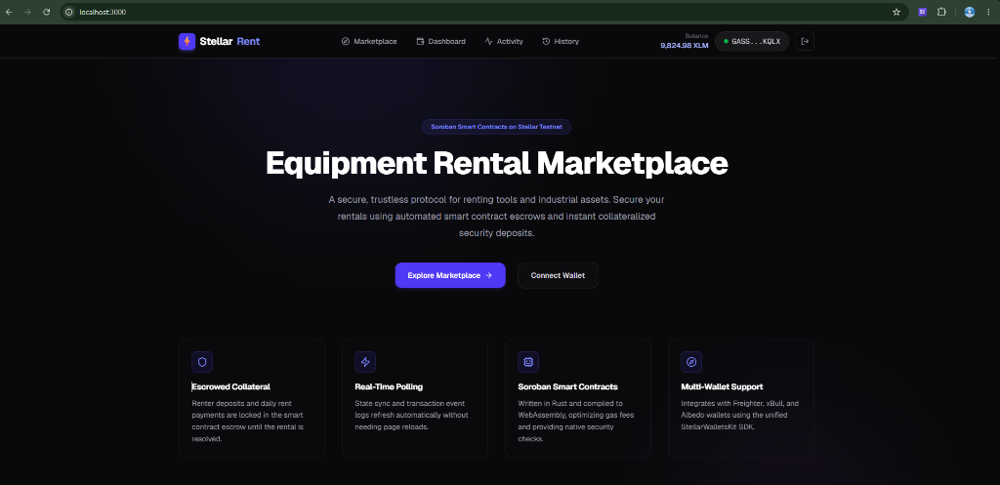
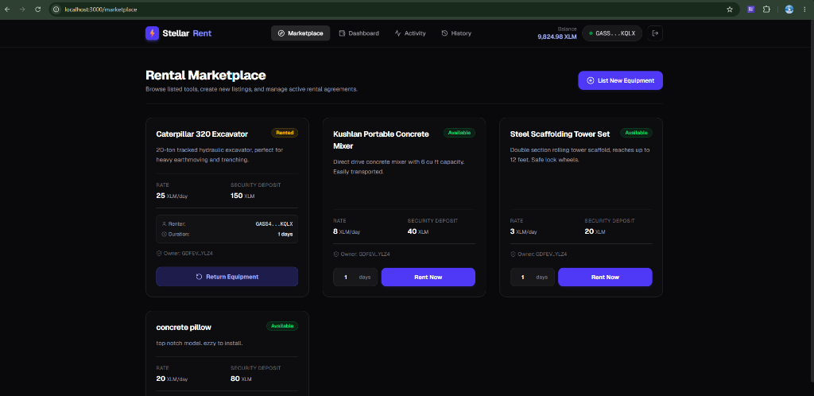
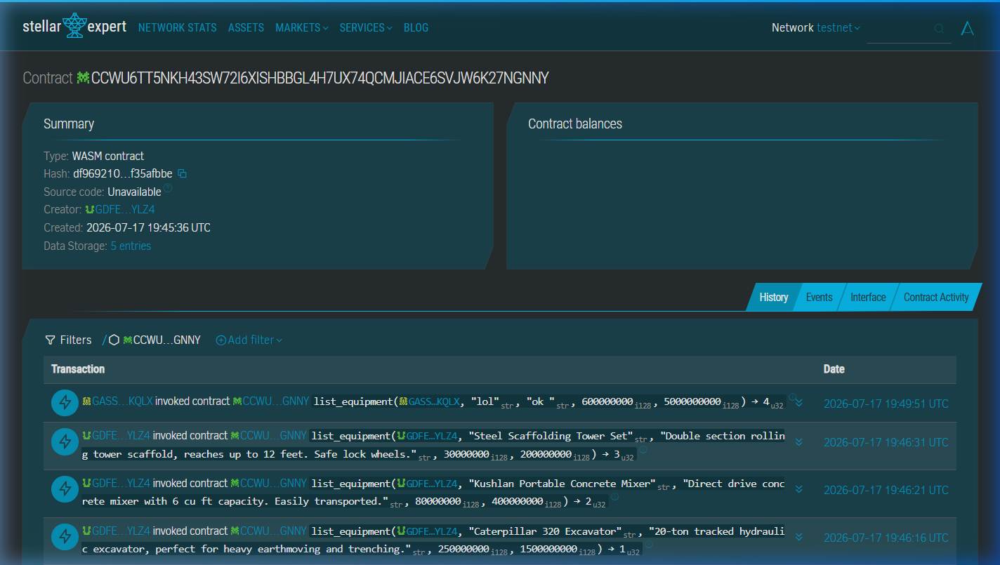
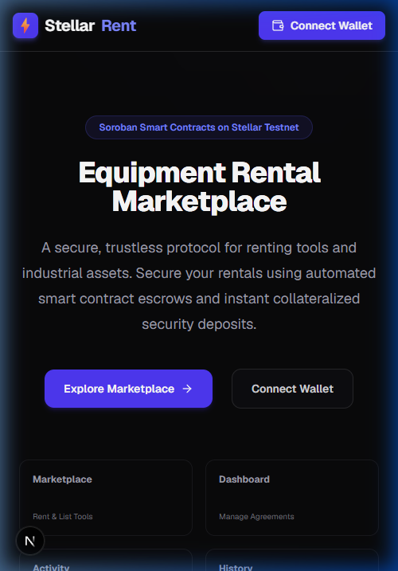
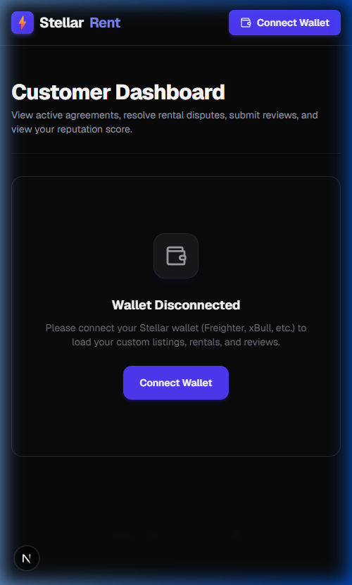

# Stellar Equipment Rental Marketplace (RentChain)

RentChain is a decentralized peer-to-peer (P2P) industrial equipment and tool rental marketplace powered by **Soroban Smart Contracts**, **Next.js 15**, and **StellarWalletsKit**. 

This DApp enables equipment owners to list tools/machinery and renters to lease them securely with safety deposits held in smart-contract escrow. It features a decentralized Reputation registry to calculate lessor/lessee reputation scores and log rating comments on-chain.

---

## 🔗 Project Links

* **GitHub Repository**: [brooklyyynnn/equipment-rental-marketplace](https://github.com/brooklyyynnn/equipment-rental-marketplace)
* **Live Demo**: [RentChain Production App](https://equipment-rental-marketplace.vercel.app/)


---

## 📸 Screenshots & Proof of Architecture

### 1. Landing Portal
*RentChain landing interface displaying marketplace volumes, interactive stats, and wallet connectivity.*


### 2. Marketplace & Catalog
*User marketplace catalog displaying active equipment listings, hire fees, and renter options.*


### 3. Stellar Expert Explorer
*On-chain verification showing smart contract interaction trace and SAC token transfer confirmations.*


### 4. Mobile Responsive UI
*Fully responsive interface optimized for mobile layout (resizing cards, stackable grids, and responsive sidebar navigation).*
![Mobile Responsive UI] 



---

## ⛓ Deployed Addresses (Stellar Testnet)

* **Marketplace Contract Address**: `CBDHXTQTI6RM57GRIGG7M7QZKLG4OWYLV6ID7JQ5LCPP5UBDROJRR6VH` (referred to as `CONTRACT_ADDRESS_HERE` in config)
* **Review Registry Address**: `CC25LHQER6EJDLCV747HWI3I3V3JUPCK4MIZFTH6NC55LTHC335Y47FC`
* **XLM Token Address (SAC Wrapper)**: `CDLZFC3SYJYDZT7K67VZ75HPJVIEUVNIXF47ZG2FB2RMQQVU2HHGCYSC`
* **Deployer Address**: `GDFEVTCEYZ6XFTU3I63RENM3FZIZT6ZAMXLNRA6TJRWXJIGJDIRMYLZ4`
* **Explorer Link**: [Stellar Expert Explorer](https://stellar.expert/explorer/testnet/contract/CBDHXTQTI6RM57GRIGG7M7QZKLG4OWYLV6ID7JQ5LCPP5UBDROJRR6VH)

---

## 🔑 Authentication Architecture

RentChain uses **Stellar Wallet Addresses (Wallet ID)** as the primary key for authentication and login.

```
[Stellar Wallet]
  ( Freighter / Albedo )
       │
       ▼  (kit.getPublicKey())
 [Stellar Address]  ──► (Primary Key)
       │
       ▼  (Zustand store: login())
 [isLoggedIn: true]
       │
       ├─► LocalStorage Sync (persists session)
       ▼
 [AuthGuard Component]
       │
       ├─► Authenticated: Render Page (/dashboard, /marketplace, etc.)
       └─► Unauthenticated: Render "Access Denied" Portal
```

1. **Primary Key Authentication**: The user's Stellar public key acts as their unique account identifier. The DApp does not require traditional email/password credentials.
2. **Session Persistence**: Once connected, the user clicks "Log In". The session status is saved to `localStorage` under `rentchain_logged_in: true` and managed globally via a Zustand state store (`hooks/useWallet.ts`).
3. **Auth Guards**: Protected client-side pages (`/dashboard`, `/marketplace`, `/activity`, `/transactions`, `/analytics`, `/settings`) are wrapped in an `AuthGuard` component. If the session is inactive, they are redirected to a lockscreen prompting authentication.
4. **Log Out**: Clicking "Log Out" clears both Zustand store memory and `localStorage` session keys.

---

## 📜 Soroban Smart Contract Specifications

### 1. Data Structures & Types
The contracts store state entries using Soroban's persistent storage.

#### Core Rental Contract (`contracts/rental/contracts/rental/src/lib.rs`)
```rust
// Storage Keys
pub enum DataKey {
    Admin,           // Instance storage: address of contract admin
    Token,           // Instance storage: address of the payment token (XLM SAC)
    EquipmentCount,  // Instance storage: total number of equipment listed
    Equipment(u64),  // Persistent storage: mapped by equipment ID
    ReviewRegistry,  // Instance storage: address of the review registry contract
}

// Equipment Struct
pub struct Equipment {
    pub id: u64,
    pub owner: Address,
    pub renter: Option<Address>,
    pub title: String,
    pub description: String,
    pub price_per_day: i128,
    pub deposit: i128,
    pub status: u32,         // 0 = Available, 1 = Rented, 2 = Returned
    pub rental_days: u64,
    pub rent_start_time: u64,
}
```

#### Review Registry Contract (`contracts/rental/contracts/review_registry/src/lib.rs`)
```rust
// Storage Keys
pub enum DataKey {
    Admin,           // Instance storage: address of contract admin
    RentalContract,  // Instance storage: address of core rental contract
    CompletedCount,  // Instance storage: total count of completed rentals
    Completed(u64),  // Persistent storage: completed rental agreements
    Reputation(Address), // Persistent storage: mapped by user address
    Review(u64, Address), // Persistent storage: mapped by (rental_id, reviewer_address)
}

// Completed Rental Struct
pub struct CompletedRental {
    pub rental_id: u64,
    pub equipment_id: u64,
    pub renter: Address,
    pub owner: Address,
    pub reviewed_by_renter: bool,
    pub reviewed_by_owner: bool,
}

// User Reputation Struct
pub struct UserReputation {
    pub owner_rating_sum: u32,
    pub owner_review_count: u32,
    pub renter_rating_sum: u32,
    pub renter_review_count: u32,
}
```

### 2. Contract Interfaces (Functions)

#### `initialize(env: Env, admin: Address, token: Address)`
Sets up the marketplace contract. Can only be invoked once.

#### `list_equipment(env: Env, owner: Address, title: String, description: String, price_per_day: i128, deposit: i128) -> u64`
Allows an owner to register a tool. Returns the generated equipment ID.
* Authorization: `owner` must authenticate.

#### `rent_equipment(env: Env, renter: Address, equipment_id: u64, days: u64)`
Allows a renter to rent an available tool. Locks daily rent + safety deposit in escrow.
* Authorization: `renter` must authenticate.

#### `return_equipment(env: Env, renter: Address, equipment_id: u64)`
Allows the renter to initiate a return, moving the status of the tool to `Returned (2)`.
* Authorization: `renter` must authenticate.

#### `resolve_rental(env: Env, owner: Address, equipment_id: u64, refund_deposit: i128, claim_deposit: i128)`
Allows the owner to inspect the returned tool, settle any damages, payout the escrows, and notify the `review_registry` cross-contract to log the deal.
* Authorization: `owner` must authenticate.

#### `submit_review(env: Env, reviewer: Address, completed_rental_id: u64, rating: u32, comment: String)`
Allows the renter or owner to submit a 1-5 star review.
* Authorization: `reviewer` must authenticate.

---

## 🚀 User Proof of Concept (PoC) Walkthrough

Follow this step-by-step test scenario to experience the DApp's core lifecycle on the Stellar Testnet. 

```
       AUTHENTICATE             LIST EQUIPMENT             RENT EQUIPMENT
┌────────────────────────┐  ┌───────────────────┐  ┌────────────────────┐
│ 1. Connect wallet      │─►│ 2. Submit tool     │─►│ 3. Lock escrow &   │
│    and sign in session │  │    catalog details │  │    start rental    │
└────────────────────────┘  └───────────────────┘  └────────────────────┘
                                                             │
                                                             ▼
         SUBMIT REVIEW            RESOLVE PAYOUT            RETURN TOOL
┌────────────────────────┐  ┌───────────────────┐  ┌────────────────────┐
│ 6. Submit 1-5 star     │◄─│ 5. Settle claims  │◄─│ 4. Initiate return │
│    reviews on-chain    │  │    and payout     │  │    post rental     │
└────────────────────────┘  └───────────────────┘  └────────────────────┘
```

### Step 1: Wallet Authentication
1. Install [Freighter Wallet](https://www.freighter.app/) extension and switch network to **Testnet**.
2. Go to the RentChain landing page (`http://localhost:3000`).
3. Click **Connect Wallet** and select Freighter.
4. Once authenticated, your session is established, and you are redirected to the **Marketplace**.

### Step 2: List a Tool
1. Go to the **Marketplace** page and click **List New Equipment**.
2. Fill out the form:
   * **Title**: `Kushlan Portable Concrete Mixer`
   * **Rate per Day**: `8 XLM`
   * **Security Deposit**: `40 XLM`
   * **Description**: `Direct drive concrete mixer.`
3. Click **Submit** and sign the transaction in Freighter.

### Step 3: Rent a Tool
1. Switch to a renter wallet account.
2. Find the listing in the catalog and choose duration (e.g. `2 days`).
3. Click **Rent Now** and sign the transaction in Freighter.
4. Daily rent (`16 XLM`) + security deposit (`40` XLM) are securely locked in the core contract escrow.

### Step 4: Return Tool
1. As the renter, go to your **Dashboard**.
2. Locate the active rental card under the "Renting" tab.
3. Click **Return Equipment** and sign the transaction in Freighter.

### Step 5: Resolve Rental & Payout
1. Switch back to the owner's wallet account and open the **Dashboard** under the "Lending" tab.
2. Click **Inspect & Resolve** next to the returned concrete mixer.
3. Enter damages to claim (if any), and click **Settle & Release Escrow**.
4. Payouts are made on-chain, and the lease details are logged in the **Review Registry** contract automatically.

### Step 6: Review & Star Reputation
1. Go to the "History" tab in the **Dashboard**.
2. Locate your completed lease, click **Leave Review**.
3. Select your rating (1-5 stars), type your review comment, and submit to log it directly on the ledger.

---

## 🛠 Setup & Run Instructions

### 1. Install Dependencies
```bash
git clone <repository_url> rental
cd rental
npm install
```

### 2. Compile & Test Smart Contract
```bash
cd contracts/rental
cargo test
```

### 3. Run Locally
Start the Next.js development server:
```bash
npm run dev
```
Open `http://localhost:3000` in your browser.
