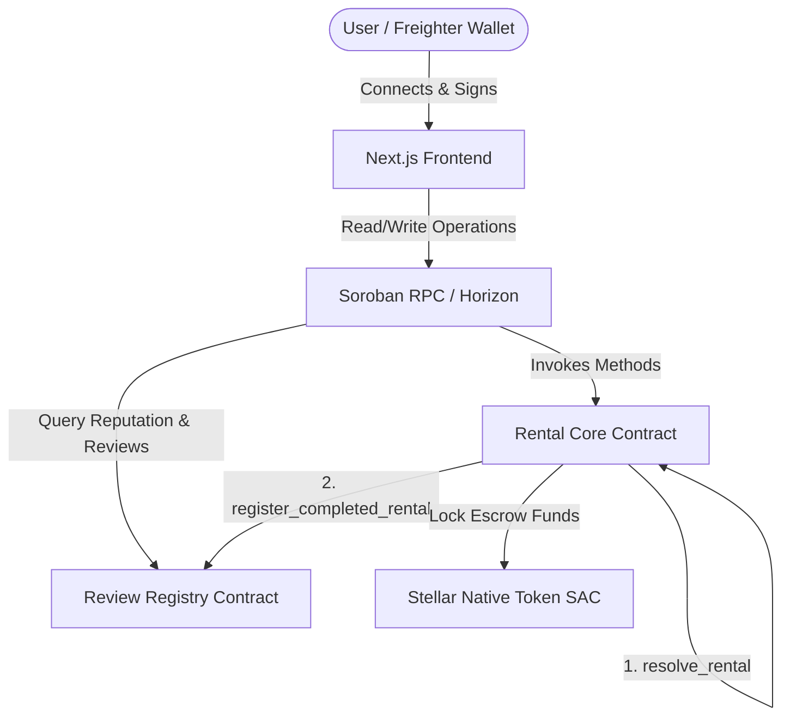
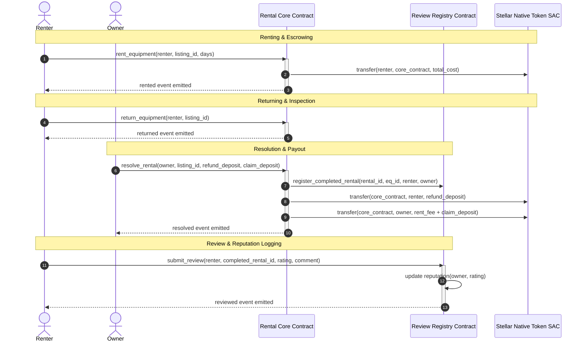

# ⚡ RentChain — Stellar Equipment Rental Marketplace

RentChain is a production-grade, decentralized peer-to-peer (P2P) industrial equipment and tool rental marketplace built on the Stellar network using Soroban smart contracts. It enables tool owners to list hardware assets and renters to lease them securely using collateralized escrows. RentChain features a secondary review and reputation ledger that logs rating comments on-chain and calculates reputation scores dynamically.

---

## 🗺️ System Architecture

### Inter-Contract Communication & Component Diagram


### On-Chain Lease & Review Workflow


---

## 🔒 Smart Contract Design

The marketplace logic is split into two specialized smart contracts to maintain concern separation and support hot-swapping or upgrades.

### 1. Rental Core Contract (`contracts/rental/contracts/rental`)
Manages listing states, escrows daily rent and security deposits, and resolves active agreements:
* **Storage Structure**: Uses `Equipment` persistent struct, tracking status (`Available = 0`, `Rented = 1`, `Returned = 2`).
* **Escrow Mechanism**: Locks daily rent payments + security deposits upon rental.
* **Double-Locked Return Protocol**: Renter must flag `return_equipment` first. The owner then inspects it and calls `resolve_rental` to claim any damages from the deposit and release remaining escrows.
* **Upgradability**: Implements `upgrade(env, new_wasm_hash)` so the admin can upgrade logic.

### 2. Review Registry Contract (`contracts/rental/contracts/review_registry`)
Tracks resolved leases, manages rating comments, and user reputation points:
* **Access Control**: Rejects completed rental registrations from any caller that is not the linked core contract address.
* **Role Verification**: Enforces that only the renter can review the owner, and vice versa. Blocks duplicate reviews.
* **Reputation Aggregator**: Computes cumulative stars and review counts for both lessor (owner) and lessee (renter) roles.
* **Upgradability**: Implements `upgrade(env, new_wasm_hash)`.

---

## 🌟 Features

* **Advanced Escrow Lifecycle**: Locks daily hire cost and security collateral in escrow.
* **On-Chain Ratings**: Allows 1-5 star ratings and reviews to be committed on the ledger.
* **Wallet Chooser**: Supports Freighter, Albedo, Hana, and xBull using the StellarWalletsKit SDK.
* **Customer Dashboard**: Displays tabbed renter portfolios, listed catalogs, and a history of completed deals.
* **Macro Settings**: Allows adjusting automatic polling intervals (5s, 15s, 30s) and wiping local logs.
* **Interactive Analytics**: Displays personal earnings/expenses and global utilization metrics.

---

## 🛠️ Tech Stack

* **Contracts**: Rust, Soroban SDK (v26)
* **Frontend**: Next.js 15 (App Router), TypeScript, Tailwind CSS
* **Wallet**: `@creit.tech/stellar-wallets-kit`, `@stellar/freighter-api`
* **State Management**: Zustand, React Query (v5)
* **Testing**: Vitest, React Testing Library, JSDOM

---

## ⚙️ Environment Variables

Copy the example variables into `.env.local` for local frontend execution:

```env
NEXT_PUBLIC_CONTRACT_ID=CONTRACT_ADDRESS_PLACEHOLDER
NEXT_PUBLIC_REVIEW_REGISTRY_ID=CONTRACT_ADDRESS_PLACEHOLDER
NEXT_PUBLIC_TOKEN_ADDRESS=CDLZFC3SYJYDZT7K67VZ75HPJVIEUVNIXF47ZG2FB2RMQQVU2HHGCYSC
NEXT_PUBLIC_NETWORK=testnet
NEXT_PUBLIC_RPC_URL=https://soroban-testnet.stellar.org
NEXT_PUBLIC_NETWORK_PASSPHRASE=Test SDF Network ; September 2015
```

---

## 🛠️ Local Development & Deployment

### 1. Compile Contracts
Build WebAssembly binaries for both contracts:
```bash
npm run contract:build
```

### 2. Deploy & Link Contracts
Deploys both contracts to Stellar Testnet, links them, generates TS bindings, and updates `.env.local` automatically:
```bash
npm run contract:deploy
```

### 3. Seed Marketplace Listings
Adds dummy listings (Excavators, Mixers) to start listing:
```bash
npm run contract:seed
```

### 4. Run Frontend App
Starts Next.js dev server:
```bash
npm run dev
```

---

## 🧪 Testing

### 1. Frontend Test Coverage
Runs Vitest unit and integration suites (verifies page rendering, transaction logs, settings, and E2E mock workflows):
```bash
npm run test
```

### 2. Smart Contract Tests
Ensure you have the Rust toolchain installed and run:
```bash
# Clean target and run unit checks
cd contracts/rental
cargo test
```

---

## 🔒 Security Practices

1. **Strict Authentication**: Uses `require_auth()` for all actions.
2. **Access-Restricted Callbacks**: Review registry requires authorization from the linked rental contract address to log completed deals.
3. **Escrow Safeguards**: Daily hire fees and deposit escrows are strictly isolated on-chain.
4. **Input Constraints**: Validates positive hire rates, deposit amounts, and limits star ratings to `1-5` on-ledger.
5. **Defensive Testing**: Uses mock environment adapters to secure configuration states against SSR leaks.

---

## 🌐 Live System Metadata

* **Marketplace Contract Address**: `CONTRACT_ADDRESS_PLACEHOLDER`
* **Review Registry Contract Address**: `CONTRACT_ADDRESS_PLACEHOLDER`
* **Stellar Transaction Hash**: `TRANSACTION_HASH_PLACEHOLDER`
* **Live Demo Web Link**: `LIVE_DEMO_PLACEHOLDER`
* **Demo Walkthrough Video**: `DEMO_VIDEO_LINK_PLACEHOLDER`
